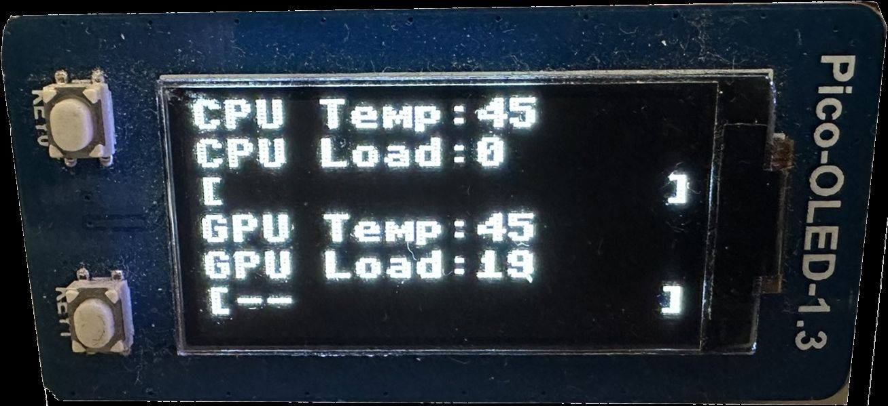

# Pico-Temp-Monitor
Temperature Monitor for Raspberry Pi Pico using WaveShare Pico-OLED 1.3 Display 

## Compatibility
- Windows
- Linux 

## Libaries
**1. Windows**
- serial
- time
- wmi

**2. Linux**
- psutil
- serial
- time

**3. Raspberry Pi Pico (receiver)**
- sys
- machine (Pin, SPI)
- framebuf
- time
- math
- _thread